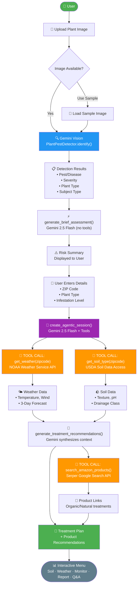

# Workflow 1: Agentic Detection & Treatment Flow

> **Chapter 9.1 & 9.2** — Separating diagnosis from downstream action / Integrating specialist tools and external APIs

This diagram illustrates the end-to-end 3-stage agentic pipeline: from image upload through Gemini Vision detection to tool-calling for personalized treatment recommendations.

## Key Design Principles (Section 9.1)

- **Separation of concerns**: Detection (Gemini Vision) is decoupled from downstream tool-calling (Gemini Agent)
- **Deterministic first step**: Vision identification runs without tools — it cannot call external APIs
- **Tool calls on demand**: The agent autonomously decides when to call `get_weather`, `get_soil_type`, and `search_amazon_products`
- **State machine stages**: `upload → details → recommendations` prevents partial-state errors
