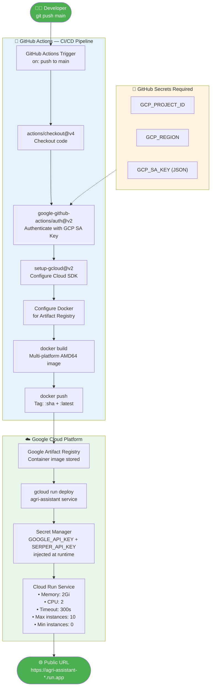

# Workflow 4: CI/CD and Cloud Run Deployment Pipeline

> **Chapter 9.4** — Deploying multimodal agents to Google Cloud Run

This diagram shows the full deployment pipeline from a code push on `main` to a live Cloud Run service, as implemented in `.github/workflows/deploy.yml`.

## Stateless Deployment Considerations (Section 9.4)

Cloud Run runs the container as **stateless serverless**. Key design choices to handle this:

| Challenge | Solution in Plant Doctor |
|-----------|-------------------------|
| Session state lost between requests | Streamlit `session_state` held in-process per user session |
| Secrets not in env | Google Secret Manager injected at deploy time |
| Image size & cold start | `python:3.11-slim` base + layer caching via `pyproject.toml` and `uv.lock` copy |
| Multi-platform compatibility | `--platform linux/amd64` explicit build flag for Apple Silicon devs |
| Scale to zero | `--min-instances 0` keeps costs at $0 when idle |
